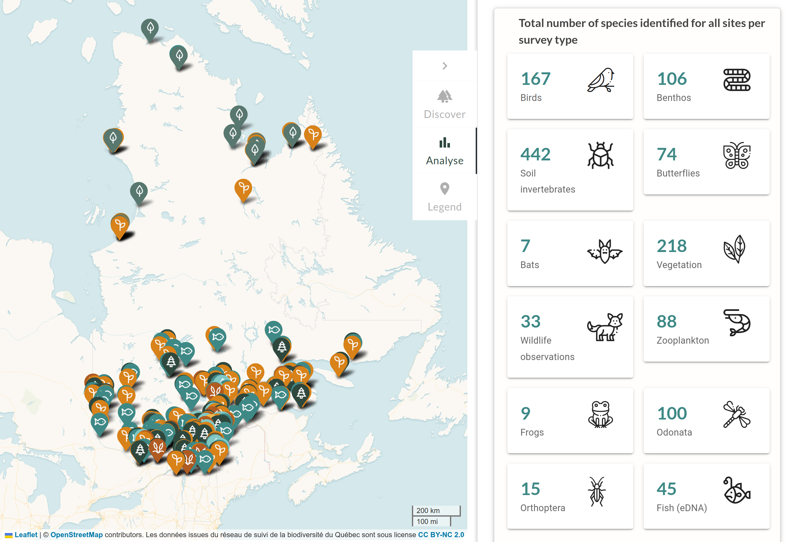
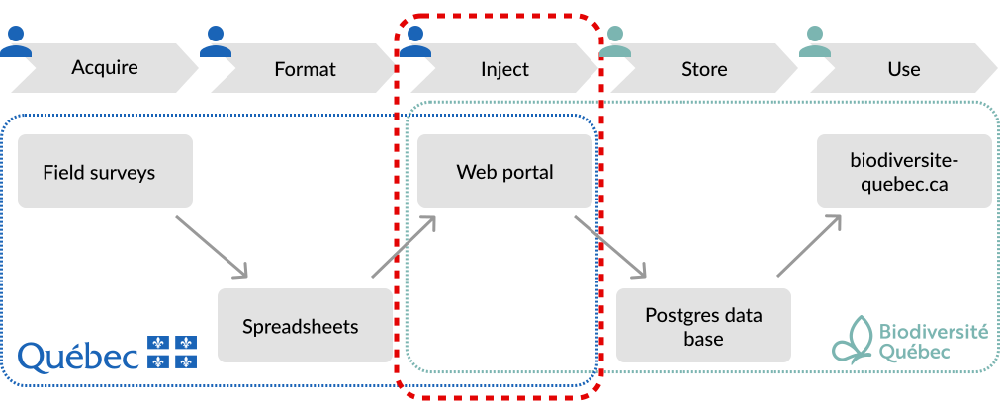
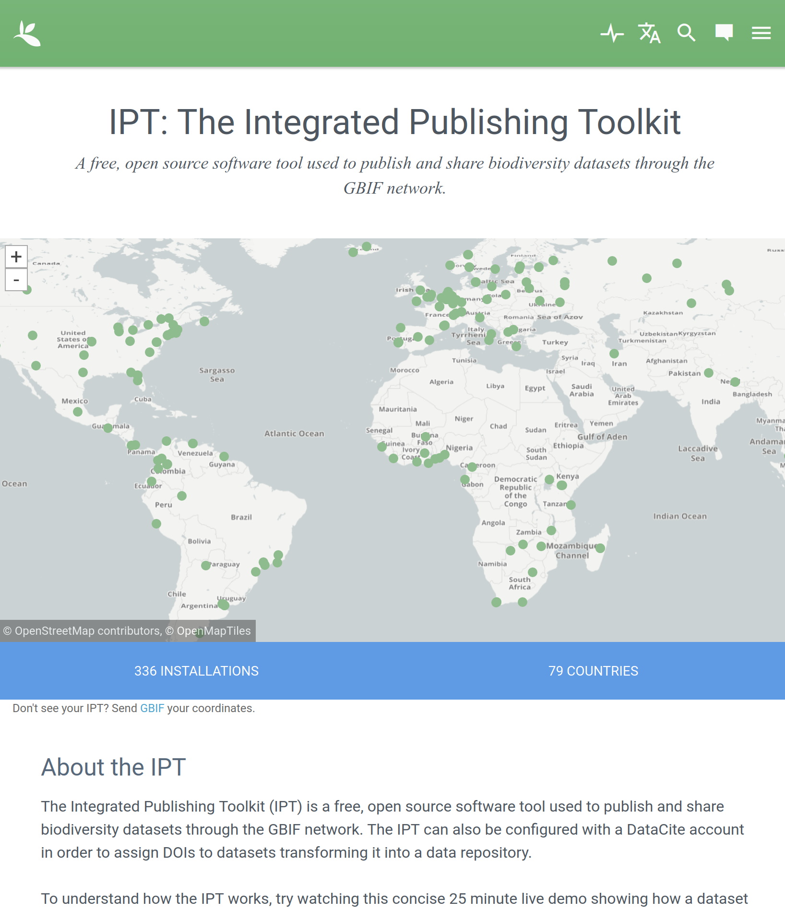
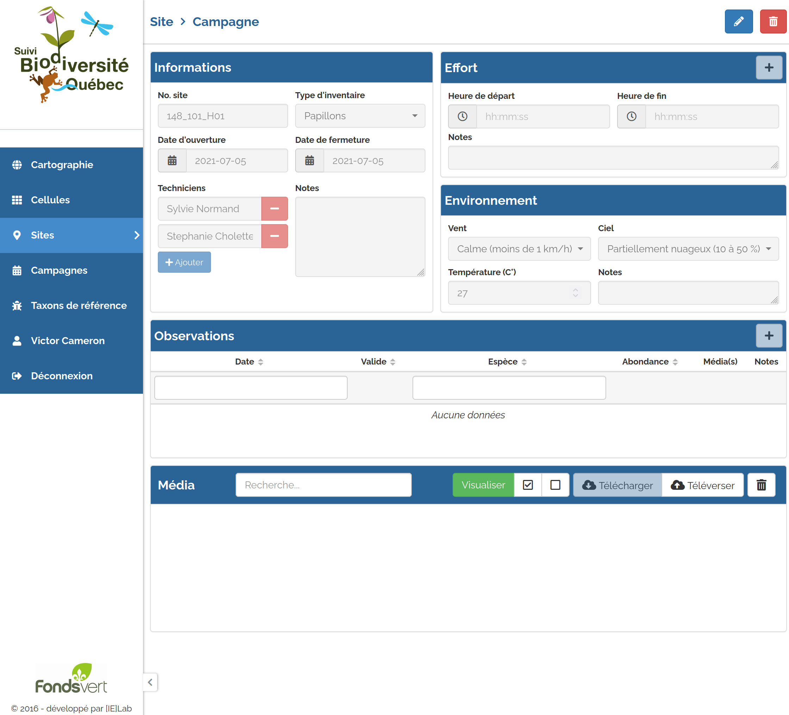
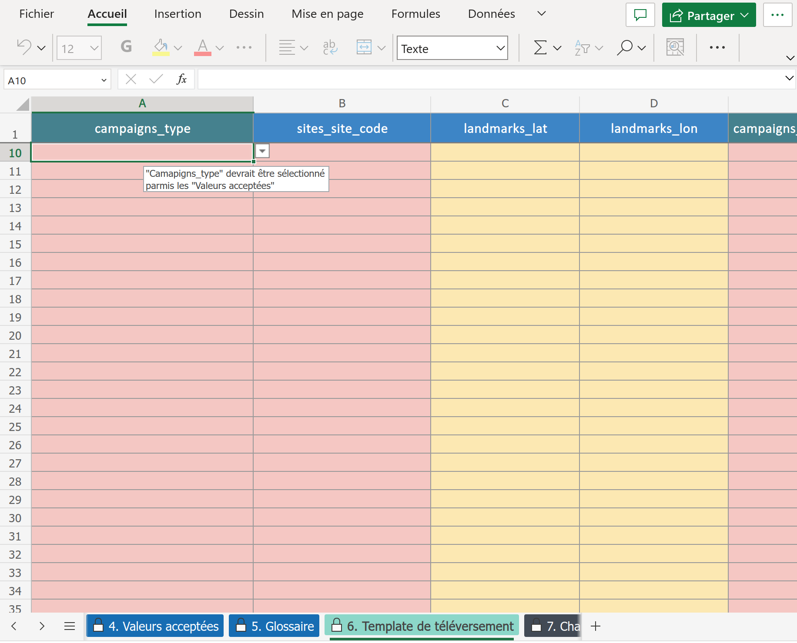

```{r setup, include=FALSE}
knitr::opts_chunk$set(
  comment = "#",
  cache = TRUE,
  collapse = TRUE,
  warning = FALSE,
  message = FALSE,
  fig.width = 7,
  fig.height = 5,
  fig.align = 'center',
  fig.retina = 3
)

options(htmltools.dir.version = FALSE)

# base plot layout
mypar = list(mar = c(3.5,4.5,1,1), mgp = c(1.5, 0.3, 0), bg="transparent", tck = -.008)

# Rscript -e "rmarkdown::render('index.Rmd')"
# sudo Rscript -e "options(pagedown.remote.maxattempts=40); pagedown::chrome_print("index.html",output="index.pdf")"
```

class: title-slide, middle

# Efficient integration of large amounts of field survey data

<hr width="65%" align="left" size="0.3" color="#d88219"></hr>

## Shifting from a state-of-the-art Web Portal to Spreadsheets

<br>

### Victor Cameron

### 2023

---

# Québec Biodiversity Observation Network

## The network is a collection of field surveys to measure ecosystem changes

.pull-left[
- 355 sites
- Monitoring since 2016
- 15+ survey types
- ~1,000,000 observations per year
<!-- - Data managed by interns and technicians -->
]

.pull-right[

]

.cite[[Biodiversité Québec](https://biodiversite-quebec.ca/)]

---

# Québec Biodiversity Observation Network

## Our mandate: create and manage the data workflow

<br>
.center[]


<!-- 
Data managed (created, corrected, used) by interns and technicians

Data processed on spreadsheets

Little use of R

Data stored in a relational database

Data can be accessed through a web portal for accessibility and security -->

---

# Québec Biodiversity Observation Network

Data formatting, management, and **software skill sets** are *barriers* to a project's data workflow

.center[]

.cite[[Karasti *et.al*, 2016](https://doi.org/10.1007/s10606-006-9023-2); [Kowaleski, 2018](http://dx.doi.org/10.2218/ijdc.v12i2.429); [GBIF, 2023](https://www.gbif.org/ipt)]

---

# Partners need an interactive interface

## GBIF's IPT

.content-box[
.pull-left[
<br>

<svg viewBox="0 0 512 512" style="height:1em;position:relative;display:inline-block;top:.1em;fill:#7ab5b0;" xmlns="http://www.w3.org/2000/svg">
  <path d="M173.898 439.404l-166.4-166.4c-9.997-9.997-9.997-26.206 0-36.204l36.203-36.204c9.997-9.998 26.207-9.998 36.204 0L192 312.69 432.095 72.596c9.997-9.997 26.207-9.997 36.204 0l36.203 36.204c9.997 9.997 9.997 26.206 0 36.204l-294.4 294.401c-9.998 9.997-26.207 9.997-36.204-.001z"></path>
</svg>
Facilitates biodiversity information sharing

<svg viewBox="0 0 512 512" style="height:1em;position:relative;display:inline-block;top:.1em;fill:#7ab5b0;" xmlns="http://www.w3.org/2000/svg">
  <path d="M173.898 439.404l-166.4-166.4c-9.997-9.997-9.997-26.206 0-36.204l36.203-36.204c9.997-9.998 26.207-9.998 36.204 0L192 312.69 432.095 72.596c9.997-9.997 26.207-9.997 36.204 0l36.203 36.204c9.997 9.997 9.997 26.206 0 36.204l-294.4 294.401c-9.998 9.997-26.207 9.997-36.204-.001z"></path>
</svg>
Manages and speeds requests to GBIF's server

<svg viewBox="0 0 512 512" style="height:1em;position:relative;display:inline-block;top:.1em;fill:#7ab5b0;" xmlns="http://www.w3.org/2000/svg">
  <path d="M173.898 439.404l-166.4-166.4c-9.997-9.997-9.997-26.206 0-36.204l36.203-36.204c9.997-9.998 26.207-9.998 36.204 0L192 312.69 432.095 72.596c9.997-9.997 26.207-9.997 36.204 0l36.203 36.204c9.997 9.997 9.997 26.206 0 36.204l-294.4 294.401c-9.998 9.997-26.207 9.997-36.204-.001z"></path>
</svg>
Encourages data-publication by increasing *usability*

<svg viewBox="0 0 512 512" style="height:1em;position:relative;display:inline-block;top:.1em;fill:#7ab5b0;" xmlns="http://www.w3.org/2000/svg">
  <path d="M173.898 439.404l-166.4-166.4c-9.997-9.997-9.997-26.206 0-36.204l36.203-36.204c9.997-9.998 26.207-9.998 36.204 0L192 312.69 432.095 72.596c9.997-9.997 26.207-9.997 36.204 0l36.203 36.204c9.997 9.997 9.997 26.206 0 36.204l-294.4 294.401c-9.998 9.997-26.207 9.997-36.204-.001z"></path>
</svg>
Regroups data management services
]

.pull-right[

]
]

.cite[[Karasti *et.al*, 2016](https://doi.org/10.1007/s10606-006-9023-2); [Kowaleski, 2018](http://dx.doi.org/10.2218/ijdc.v12i2.429); [GBIF, 2023](https://www.gbif.org/ipt)]

 <!-- 
  - Development and maintenance. 
  - Iterative process: >30 releases since first version in 2011.
  - Training and support (the demo is 25 minutes!). 
  - Adapt to the needs of the network. -->

---

# Partners need an interactive interface

## GBIF's IPT

.content-box[
.pull-left[
<br>

<svg viewBox="0 0 512 512" style="height:1em;position:relative;display:inline-block;top:.1em;fill:#7ab5b0;" xmlns="http://www.w3.org/2000/svg">
  <path d="M173.898 439.404l-166.4-166.4c-9.997-9.997-9.997-26.206 0-36.204l36.203-36.204c9.997-9.998 26.207-9.998 36.204 0L192 312.69 432.095 72.596c9.997-9.997 26.207-9.997 36.204 0l36.203 36.204c9.997 9.997 9.997 26.206 0 36.204l-294.4 294.401c-9.998 9.997-26.207 9.997-36.204-.001z"></path>
</svg>
Facilitates biodiversity information sharing

<svg viewBox="0 0 512 512" style="height:1em;position:relative;display:inline-block;top:.1em;fill:#7ab5b0;" xmlns="http://www.w3.org/2000/svg">
  <path d="M173.898 439.404l-166.4-166.4c-9.997-9.997-9.997-26.206 0-36.204l36.203-36.204c9.997-9.998 26.207-9.998 36.204 0L192 312.69 432.095 72.596c9.997-9.997 26.207-9.997 36.204 0l36.203 36.204c9.997 9.997 9.997 26.206 0 36.204l-294.4 294.401c-9.998 9.997-26.207 9.997-36.204-.001z"></path>
</svg>
Manages and speeds requests to GBIF's server

<svg viewBox="0 0 512 512" style="height:1em;position:relative;display:inline-block;top:.1em;fill:#7ab5b0;" xmlns="http://www.w3.org/2000/svg">
  <path d="M173.898 439.404l-166.4-166.4c-9.997-9.997-9.997-26.206 0-36.204l36.203-36.204c9.997-9.998 26.207-9.998 36.204 0L192 312.69 432.095 72.596c9.997-9.997 26.207-9.997 36.204 0l36.203 36.204c9.997 9.997 9.997 26.206 0 36.204l-294.4 294.401c-9.998 9.997-26.207 9.997-36.204-.001z"></path>
</svg>
Encourages data-publication by increasing *usability*

<svg viewBox="0 0 512 512" style="height:1em;position:relative;display:inline-block;top:.1em;fill:#7ab5b0;" xmlns="http://www.w3.org/2000/svg">
  <path d="M173.898 439.404l-166.4-166.4c-9.997-9.997-9.997-26.206 0-36.204l36.203-36.204c9.997-9.998 26.207-9.998 36.204 0L192 312.69 432.095 72.596c9.997-9.997 26.207-9.997 36.204 0l36.203 36.204c9.997 9.997 9.997 26.206 0 36.204l-294.4 294.401c-9.998 9.997-26.207 9.997-36.204-.001z"></path>
</svg>
Regroups data management services
]

.pull-right[
<br>
<svg viewBox="0 0 576 512" style="height:1em;position:relative;display:inline-block;top:.1em;fill:#d88219;" xmlns="http://www.w3.org/2000/svg">
  <path d="M569.517 440.013C587.975 472.007 564.806 512 527.94 512H48.054c-36.937 0-59.999-40.055-41.577-71.987L246.423 23.985c18.467-32.009 64.72-31.951 83.154 0l239.94 416.028zM288 354c-25.405 0-46 20.595-46 46s20.595 46 46 46 46-20.595 46-46-20.595-46-46-46zm-43.673-165.346l7.418 136c.347 6.364 5.609 11.346 11.982 11.346h48.546c6.373 0 11.635-4.982 11.982-11.346l7.418-136c.375-6.874-5.098-12.654-11.982-12.654h-63.383c-6.884 0-12.356 5.78-11.981 12.654z"></path>
</svg>
Intensive development and maintenance

<svg viewBox="0 0 576 512" style="height:1em;position:relative;display:inline-block;top:.1em;fill:#d88219;" xmlns="http://www.w3.org/2000/svg">
  <path d="M569.517 440.013C587.975 472.007 564.806 512 527.94 512H48.054c-36.937 0-59.999-40.055-41.577-71.987L246.423 23.985c18.467-32.009 64.72-31.951 83.154 0l239.94 416.028zM288 354c-25.405 0-46 20.595-46 46s20.595 46 46 46 46-20.595 46-46-20.595-46-46-46zm-43.673-165.346l7.418 136c.347 6.364 5.609 11.346 11.982 11.346h48.546c6.373 0 11.635-4.982 11.982-11.346l7.418-136c.375-6.874-5.098-12.654-11.982-12.654h-63.383c-6.884 0-12.356 5.78-11.981 12.654z"></path>
</svg>
Iterative process

<svg viewBox="0 0 576 512" style="height:1em;position:relative;display:inline-block;top:.1em;fill:#d88219;" xmlns="http://www.w3.org/2000/svg">
  <path d="M569.517 440.013C587.975 472.007 564.806 512 527.94 512H48.054c-36.937 0-59.999-40.055-41.577-71.987L246.423 23.985c18.467-32.009 64.72-31.951 83.154 0l239.94 416.028zM288 354c-25.405 0-46 20.595-46 46s20.595 46 46 46 46-20.595 46-46-20.595-46-46-46zm-43.673-165.346l7.418 136c.347 6.364 5.609 11.346 11.982 11.346h48.546c6.373 0 11.635-4.982 11.982-11.346l7.418-136c.375-6.874-5.098-12.654-11.982-12.654h-63.383c-6.884 0-12.356 5.78-11.981 12.654z"></path>
</svg>
Training and support

<svg viewBox="0 0 576 512" style="height:1em;position:relative;display:inline-block;top:.1em;fill:#d88219;" xmlns="http://www.w3.org/2000/svg">
  <path d="M569.517 440.013C587.975 472.007 564.806 512 527.94 512H48.054c-36.937 0-59.999-40.055-41.577-71.987L246.423 23.985c18.467-32.009 64.72-31.951 83.154 0l239.94 416.028zM288 354c-25.405 0-46 20.595-46 46s20.595 46 46 46 46-20.595 46-46-20.595-46-46-46zm-43.673-165.346l7.418 136c.347 6.364 5.609 11.346 11.982 11.346h48.546c6.373 0 11.635-4.982 11.982-11.346l7.418-136c.375-6.874-5.098-12.654-11.982-12.654h-63.383c-6.884 0-12.356 5.78-11.981 12.654z"></path>
</svg>
Adapt to the needs of the network
]
]

---

# Partners need an interactive interface

## Our web portal

.content-box[
.pull-left[
<br>

<svg viewBox="0 0 512 512" style="height:1em;position:relative;display:inline-block;top:.1em;fill:#7ab5b0;" xmlns="http://www.w3.org/2000/svg">
  <path d="M173.898 439.404l-166.4-166.4c-9.997-9.997-9.997-26.206 0-36.204l36.203-36.204c9.997-9.998 26.207-9.998 36.204 0L192 312.69 432.095 72.596c9.997-9.997 26.207-9.997 36.204 0l36.203 36.204c9.997 9.997 9.997 26.206 0 36.204l-294.4 294.401c-9.998 9.997-26.207 9.997-36.204-.001z"></path>
</svg>
Data availability

<svg viewBox="0 0 512 512" style="height:1em;position:relative;display:inline-block;top:.1em;fill:#7ab5b0;" xmlns="http://www.w3.org/2000/svg">
  <path d="M173.898 439.404l-166.4-166.4c-9.997-9.997-9.997-26.206 0-36.204l36.203-36.204c9.997-9.998 26.207-9.998 36.204 0L192 312.69 432.095 72.596c9.997-9.997 26.207-9.997 36.204 0l36.203 36.204c9.997 9.997 9.997 26.206 0 36.204l-294.4 294.401c-9.998 9.997-26.207 9.997-36.204-.001z"></path>
</svg>
Data injection

<svg viewBox="0 0 512 512" style="height:1em;position:relative;display:inline-block;top:.1em;fill:#7ab5b0;" xmlns="http://www.w3.org/2000/svg">
  <path d="M173.898 439.404l-166.4-166.4c-9.997-9.997-9.997-26.206 0-36.204l36.203-36.204c9.997-9.998 26.207-9.998 36.204 0L192 312.69 432.095 72.596c9.997-9.997 26.207-9.997 36.204 0l36.203 36.204c9.997 9.997 9.997 26.206 0 36.204l-294.4 294.401c-9.998 9.997-26.207 9.997-36.204-.001z"></path>
</svg>
Data quality control

<svg viewBox="0 0 512 512" style="height:1em;position:relative;display:inline-block;top:.1em;fill:#7ab5b0;" xmlns="http://www.w3.org/2000/svg">
  <path d="M173.898 439.404l-166.4-166.4c-9.997-9.997-9.997-26.206 0-36.204l36.203-36.204c9.997-9.998 26.207-9.998 36.204 0L192 312.69 432.095 72.596c9.997-9.997 26.207-9.997 36.204 0l36.203 36.204c9.997 9.997 9.997 26.206 0 36.204l-294.4 294.401c-9.998 9.997-26.207 9.997-36.204-.001z"></path>
</svg>
Data privacy

<svg viewBox="0 0 512 512" style="height:1em;position:relative;display:inline-block;top:.1em;fill:#7ab5b0;" xmlns="http://www.w3.org/2000/svg">
  <path d="M173.898 439.404l-166.4-166.4c-9.997-9.997-9.997-26.206 0-36.204l36.203-36.204c9.997-9.998 26.207-9.998 36.204 0L192 312.69 432.095 72.596c9.997-9.997 26.207-9.997 36.204 0l36.203 36.204c9.997 9.997 9.997 26.206 0 36.204l-294.4 294.401c-9.998 9.997-26.207 9.997-36.204-.001z"></path>
</svg>
Well-designed interface
]

.pull-right[

]
]

---

# Partners need an interactive interface

## Our web portal

.content-box[
.pull-left[
<br>

<svg viewBox="0 0 512 512" style="height:1em;position:relative;display:inline-block;top:.1em;fill:#7ab5b0;" xmlns="http://www.w3.org/2000/svg">
  <path d="M173.898 439.404l-166.4-166.4c-9.997-9.997-9.997-26.206 0-36.204l36.203-36.204c9.997-9.998 26.207-9.998 36.204 0L192 312.69 432.095 72.596c9.997-9.997 26.207-9.997 36.204 0l36.203 36.204c9.997 9.997 9.997 26.206 0 36.204l-294.4 294.401c-9.998 9.997-26.207 9.997-36.204-.001z"></path>
</svg>
Data availability

<svg viewBox="0 0 512 512" style="height:1em;position:relative;display:inline-block;top:.1em;fill:#7ab5b0;" xmlns="http://www.w3.org/2000/svg">
  <path d="M173.898 439.404l-166.4-166.4c-9.997-9.997-9.997-26.206 0-36.204l36.203-36.204c9.997-9.998 26.207-9.998 36.204 0L192 312.69 432.095 72.596c9.997-9.997 26.207-9.997 36.204 0l36.203 36.204c9.997 9.997 9.997 26.206 0 36.204l-294.4 294.401c-9.998 9.997-26.207 9.997-36.204-.001z"></path>
</svg>
Data injection

<svg viewBox="0 0 512 512" style="height:1em;position:relative;display:inline-block;top:.1em;fill:#7ab5b0;" xmlns="http://www.w3.org/2000/svg">
  <path d="M173.898 439.404l-166.4-166.4c-9.997-9.997-9.997-26.206 0-36.204l36.203-36.204c9.997-9.998 26.207-9.998 36.204 0L192 312.69 432.095 72.596c9.997-9.997 26.207-9.997 36.204 0l36.203 36.204c9.997 9.997 9.997 26.206 0 36.204l-294.4 294.401c-9.998 9.997-26.207 9.997-36.204-.001z"></path>
</svg>
Data quality control

<svg viewBox="0 0 512 512" style="height:1em;position:relative;display:inline-block;top:.1em;fill:#7ab5b0;" xmlns="http://www.w3.org/2000/svg">
  <path d="M173.898 439.404l-166.4-166.4c-9.997-9.997-9.997-26.206 0-36.204l36.203-36.204c9.997-9.998 26.207-9.998 36.204 0L192 312.69 432.095 72.596c9.997-9.997 26.207-9.997 36.204 0l36.203 36.204c9.997 9.997 9.997 26.206 0 36.204l-294.4 294.401c-9.998 9.997-26.207 9.997-36.204-.001z"></path>
</svg>
Data privacy

<svg viewBox="0 0 512 512" style="height:1em;position:relative;display:inline-block;top:.1em;fill:#7ab5b0;" xmlns="http://www.w3.org/2000/svg">
  <path d="M173.898 439.404l-166.4-166.4c-9.997-9.997-9.997-26.206 0-36.204l36.203-36.204c9.997-9.998 26.207-9.998 36.204 0L192 312.69 432.095 72.596c9.997-9.997 26.207-9.997 36.204 0l36.203 36.204c9.997 9.997 9.997 26.206 0 36.204l-294.4 294.401c-9.998 9.997-26.207 9.997-36.204-.001z"></path>
</svg>
Well-designed interface
]

.pull-right[
<br>
<svg viewBox="0 0 576 512" style="height:1em;position:relative;display:inline-block;top:.1em;fill:#d88219;" xmlns="http://www.w3.org/2000/svg">
  <path d="M569.517 440.013C587.975 472.007 564.806 512 527.94 512H48.054c-36.937 0-59.999-40.055-41.577-71.987L246.423 23.985c18.467-32.009 64.72-31.951 83.154 0l239.94 416.028zM288 354c-25.405 0-46 20.595-46 46s20.595 46 46 46 46-20.595 46-46-20.595-46-46-46zm-43.673-165.346l7.418 136c.347 6.364 5.609 11.346 11.982 11.346h48.546c6.373 0 11.635-4.982 11.982-11.346l7.418-136c.375-6.874-5.098-12.654-11.982-12.654h-63.383c-6.884 0-12.356 5.78-11.981 12.654z"></path>
</svg>
Vulnerable to technological obsolescence

<svg viewBox="0 0 576 512" style="height:1em;position:relative;display:inline-block;top:.1em;fill:#d88219;" xmlns="http://www.w3.org/2000/svg">
  <path d="M569.517 440.013C587.975 472.007 564.806 512 527.94 512H48.054c-36.937 0-59.999-40.055-41.577-71.987L246.423 23.985c18.467-32.009 64.72-31.951 83.154 0l239.94 416.028zM288 354c-25.405 0-46 20.595-46 46s20.595 46 46 46 46-20.595 46-46-20.595-46-46-46zm-43.673-165.346l7.418 136c.347 6.364 5.609 11.346 11.982 11.346h48.546c6.373 0 11.635-4.982 11.982-11.346l7.418-136c.375-6.874-5.098-12.654-11.982-12.654h-63.383c-6.884 0-12.356 5.78-11.981 12.654z"></path>
</svg>
Limited flexibility to accomodate new data schemas

<svg viewBox="0 0 576 512" style="height:1em;position:relative;display:inline-block;top:.1em;fill:#d88219;" xmlns="http://www.w3.org/2000/svg">
  <path d="M569.517 440.013C587.975 472.007 564.806 512 527.94 512H48.054c-36.937 0-59.999-40.055-41.577-71.987L246.423 23.985c18.467-32.009 64.72-31.951 83.154 0l239.94 416.028zM288 354c-25.405 0-46 20.595-46 46s20.595 46 46 46 46-20.595 46-46-20.595-46-46-46zm-43.673-165.346l7.418 136c.347 6.364 5.609 11.346 11.982 11.346h48.546c6.373 0 11.635-4.982 11.982-11.346l7.418-136c.375-6.874-5.098-12.654-11.982-12.654h-63.383c-6.884 0-12.356 5.78-11.981 12.654z"></path>
</svg>
User experience is more complex than anticipated
]
]

<!-- Observation: seems to meet the needs initially identified, but the user experience is complex and requires a major training and support effort. 
Requires considerable maintenance effort in a context of adaptation. 
A lot of effort put into the user interface (**UI**) (interactive design, layout, branding, etc.), but too little into the user experience (**UX**). 
So: little or no use. -->

---

# Lessons learned

.large[
<svg viewBox="0 0 352 512" style="height:1em;position:relative;display:inline-block;top:.1em;fill:#7ab5b0" xmlns="http://www.w3.org/2000/svg">
  <path d="M96.06 454.35c.01 6.29 1.87 12.45 5.36 17.69l17.09 25.69a31.99 31.99 0 0 0 26.64 14.28h61.71a31.99 31.99 0 0 0 26.64-14.28l17.09-25.69a31.989 31.989 0 0 0 5.36-17.69l.04-38.35H96.01l.05 38.35zM0 176c0 44.37 16.45 84.85 43.56 115.78 16.52 18.85 42.36 58.23 52.21 91.45.04.26.07.52.11.78h160.24c.04-.26.07-.51.11-.78 9.85-33.22 35.69-72.6 52.21-91.45C335.55 260.85 352 220.37 352 176 352 78.61 272.91-.3 175.45 0 73.44.31 0 82.97 0 176zm176-80c-44.11 0-80 35.89-80 80 0 8.84-7.16 16-16 16s-16-7.16-16-16c0-61.76 50.24-112 112-112 8.84 0 16 7.16 16 16s-7.16 16-16 16z"></path>
</svg>
Schema of acquired data evolves with the needs of field technicians and protocols

<svg viewBox="0 0 352 512" style="height:1em;position:relative;display:inline-block;top:.1em;fill:#7ab5b0" xmlns="http://www.w3.org/2000/svg">
  <path d="M96.06 454.35c.01 6.29 1.87 12.45 5.36 17.69l17.09 25.69a31.99 31.99 0 0 0 26.64 14.28h61.71a31.99 31.99 0 0 0 26.64-14.28l17.09-25.69a31.989 31.989 0 0 0 5.36-17.69l.04-38.35H96.01l.05 38.35zM0 176c0 44.37 16.45 84.85 43.56 115.78 16.52 18.85 42.36 58.23 52.21 91.45.04.26.07.52.11.78h160.24c.04-.26.07-.51.11-.78 9.85-33.22 35.69-72.6 52.21-91.45C335.55 260.85 352 220.37 352 176 352 78.61 272.91-.3 175.45 0 73.44.31 0 82.97 0 176zm176-80c-44.11 0-80 35.89-80 80 0 8.84-7.16 16-16 16s-16-7.16-16-16c0-61.76 50.24-112 112-112 8.84 0 16 7.16 16 16s-7.16 16-16 16z"></path>
</svg>
Skill level and comfort with software tools vary widely between partners, participants, and technicians who manipulate the data

<svg viewBox="0 0 352 512" style="height:1em;position:relative;display:inline-block;top:.1em;fill:#7ab5b0" xmlns="http://www.w3.org/2000/svg">
  <path d="M96.06 454.35c.01 6.29 1.87 12.45 5.36 17.69l17.09 25.69a31.99 31.99 0 0 0 26.64 14.28h61.71a31.99 31.99 0 0 0 26.64-14.28l17.09-25.69a31.989 31.989 0 0 0 5.36-17.69l.04-38.35H96.01l.05 38.35zM0 176c0 44.37 16.45 84.85 43.56 115.78 16.52 18.85 42.36 58.23 52.21 91.45.04.26.07.52.11.78h160.24c.04-.26.07-.51.11-.78 9.85-33.22 35.69-72.6 52.21-91.45C335.55 260.85 352 220.37 352 176 352 78.61 272.91-.3 175.45 0 73.44.31 0 82.97 0 176zm176-80c-44.11 0-80 35.89-80 80 0 8.84-7.16 16-16 16s-16-7.16-16-16c0-61.76 50.24-112 112-112 8.84 0 16 7.16 16 16s-7.16 16-16 16z"></path>
</svg>
Data management and usage require quality control and interactive interfaces
]


<!-- 
# Québec Biodiversity Observation Network

## State-of-the-art web application : little or no use

- App structured on the database 
- One by one observation injection

Aspects that could be improved upon

- Suitability for the user's tasks
- learnability
- controllability
- Flexibility
-  -->

---

# Spreadsheet-based template system

<br>

.center[]

---

# Spreadsheet-based template system

Template = data + metadata + formatting guide + validation rules

.content-box[
.pull-left[
**Spreadsheet templates**

<svg viewBox="0 0 512 512" style="height:1em;position:relative;display:inline-block;top:.1em;fill:#7ab5b0;" xmlns="http://www.w3.org/2000/svg">
  <path d="M173.898 439.404l-166.4-166.4c-9.997-9.997-9.997-26.206 0-36.204l36.203-36.204c9.997-9.998 26.207-9.998 36.204 0L192 312.69 432.095 72.596c9.997-9.997 26.207-9.997 36.204 0l36.203 36.204c9.997 9.997 9.997 26.206 0 36.204l-294.4 294.401c-9.998 9.997-26.207 9.997-36.204-.001z"></path>
</svg>
Builds on partners' existing skill sets and workflows

<svg viewBox="0 0 512 512" style="height:1em;position:relative;display:inline-block;top:.1em;fill:#7ab5b0;" xmlns="http://www.w3.org/2000/svg">
  <path d="M173.898 439.404l-166.4-166.4c-9.997-9.997-9.997-26.206 0-36.204l36.203-36.204c9.997-9.998 26.207-9.998 36.204 0L192 312.69 432.095 72.596c9.997-9.997 26.207-9.997 36.204 0l36.203 36.204c9.997 9.997 9.997 26.206 0 36.204l-294.4 294.401c-9.998 9.997-26.207 9.997-36.204-.001z"></path>
</svg>
Easier to maintain

<svg viewBox="0 0 512 512" style="height:1em;position:relative;display:inline-block;top:.1em;fill:#7ab5b0;" xmlns="http://www.w3.org/2000/svg">
  <path d="M173.898 439.404l-166.4-166.4c-9.997-9.997-9.997-26.206 0-36.204l36.203-36.204c9.997-9.998 26.207-9.998 36.204 0L192 312.69 432.095 72.596c9.997-9.997 26.207-9.997 36.204 0l36.203 36.204c9.997 9.997 9.997 26.206 0 36.204l-294.4 294.401c-9.998 9.997-26.207 9.997-36.204-.001z"></path>
</svg>
Fast adoption and important reduction of errors

<svg viewBox="0 0 512 512" style="height:1em;position:relative;display:inline-block;top:.1em;fill:#7ab5b0;" xmlns="http://www.w3.org/2000/svg">
  <path d="M173.898 439.404l-166.4-166.4c-9.997-9.997-9.997-26.206 0-36.204l36.203-36.204c9.997-9.998 26.207-9.998 36.204 0L192 312.69 432.095 72.596c9.997-9.997 26.207-9.997 36.204 0l36.203 36.204c9.997 9.997 9.997 26.206 0 36.204l-294.4 294.401c-9.998 9.997-26.207 9.997-36.204-.001z"></path>
</svg>
Fast to develop and to adapt
]

.pull-right[

]
]

---

# Spreadsheet-based template system

Template = data + metadata + formatting guide + validation rules

.content-box[
.pull-left[
**Spreadsheet templates**

<svg viewBox="0 0 512 512" style="height:1em;position:relative;display:inline-block;top:.1em;fill:#7ab5b0;" xmlns="http://www.w3.org/2000/svg">
  <path d="M173.898 439.404l-166.4-166.4c-9.997-9.997-9.997-26.206 0-36.204l36.203-36.204c9.997-9.998 26.207-9.998 36.204 0L192 312.69 432.095 72.596c9.997-9.997 26.207-9.997 36.204 0l36.203 36.204c9.997 9.997 9.997 26.206 0 36.204l-294.4 294.401c-9.998 9.997-26.207 9.997-36.204-.001z"></path>
</svg>
Builds on partners' existing skill sets and workflows

<svg viewBox="0 0 512 512" style="height:1em;position:relative;display:inline-block;top:.1em;fill:#7ab5b0;" xmlns="http://www.w3.org/2000/svg">
  <path d="M173.898 439.404l-166.4-166.4c-9.997-9.997-9.997-26.206 0-36.204l36.203-36.204c9.997-9.998 26.207-9.998 36.204 0L192 312.69 432.095 72.596c9.997-9.997 26.207-9.997 36.204 0l36.203 36.204c9.997 9.997 9.997 26.206 0 36.204l-294.4 294.401c-9.998 9.997-26.207 9.997-36.204-.001z"></path>
</svg>
Easier to maintain

<svg viewBox="0 0 512 512" style="height:1em;position:relative;display:inline-block;top:.1em;fill:#7ab5b0;" xmlns="http://www.w3.org/2000/svg">
  <path d="M173.898 439.404l-166.4-166.4c-9.997-9.997-9.997-26.206 0-36.204l36.203-36.204c9.997-9.998 26.207-9.998 36.204 0L192 312.69 432.095 72.596c9.997-9.997 26.207-9.997 36.204 0l36.203 36.204c9.997 9.997 9.997 26.206 0 36.204l-294.4 294.401c-9.998 9.997-26.207 9.997-36.204-.001z"></path>
</svg>
Fast adoption and important reduction of errors

<svg viewBox="0 0 512 512" style="height:1em;position:relative;display:inline-block;top:.1em;fill:#7ab5b0;" xmlns="http://www.w3.org/2000/svg">
  <path d="M173.898 439.404l-166.4-166.4c-9.997-9.997-9.997-26.206 0-36.204l36.203-36.204c9.997-9.998 26.207-9.998 36.204 0L192 312.69 432.095 72.596c9.997-9.997 26.207-9.997 36.204 0l36.203 36.204c9.997 9.997 9.997 26.206 0 36.204l-294.4 294.401c-9.998 9.997-26.207 9.997-36.204-.001z"></path>
</svg>
Fast to develop and to adapt
]

.pull-right[
<br>
<svg viewBox="0 0 576 512" style="height:1em;position:relative;display:inline-block;top:.1em;fill:#d88219;" xmlns="http://www.w3.org/2000/svg">
  <path d="M569.517 440.013C587.975 472.007 564.806 512 527.94 512H48.054c-36.937 0-59.999-40.055-41.577-71.987L246.423 23.985c18.467-32.009 64.72-31.951 83.154 0l239.94 416.028zM288 354c-25.405 0-46 20.595-46 46s20.595 46 46 46 46-20.595 46-46-20.595-46-46-46zm-43.673-165.346l7.418 136c.347 6.364 5.609 11.346 11.982 11.346h48.546c6.373 0 11.635-4.982 11.982-11.346l7.418-136c.375-6.874-5.098-12.654-11.982-12.654h-63.383c-6.884 0-12.356 5.78-11.981 12.654z"></path>
</svg>
Proprietary software

<svg viewBox="0 0 576 512" style="height:1em;position:relative;display:inline-block;top:.1em;fill:#d88219;" xmlns="http://www.w3.org/2000/svg">
  <path d="M569.517 440.013C587.975 472.007 564.806 512 527.94 512H48.054c-36.937 0-59.999-40.055-41.577-71.987L246.423 23.985c18.467-32.009 64.72-31.951 83.154 0l239.94 416.028zM288 354c-25.405 0-46 20.595-46 46s20.595 46 46 46 46-20.595 46-46-20.595-46-46-46zm-43.673-165.346l7.418 136c.347 6.364 5.609 11.346 11.982 11.346h48.546c6.373 0 11.635-4.982 11.982-11.346l7.418-136c.375-6.874-5.098-12.654-11.982-12.654h-63.383c-6.884 0-12.356 5.78-11.981 12.654z"></path>
</svg>
Difficult to make reproducible
]
]

.coleoteal[However, web-based visualization tools have proven effective in communicating.]

---

# Spreadsheet-based template system

## The revised workflow better meets the project's needs

<!-- Mandate, users, plan, complexities -->

.center[]


---
class: inverse

# .center[Take home messages]
<html><div style='float:left'></div><hr color='#d88219' size=1px width=720px></html>


.large[
Opt for tools that fit the team skill set and processes

Evolving needs and varied level of skill of partners present large challenges

Budget and plan for highly qualified human resources for maintenance and improvements
]

---
class: inverse 

# .center[Reach out!]
<html><div style='float:left'></div><hr color='#d88219' size=1px width=720px></html>

.pull-left[
<br>
<br>
.large[Victor Cameron] <br>
.small[Eco-informatician, lecturer ]

.coleoteal[victor.cameron@usherbrooke.ca] <br>
.coleoteal[www.biodiversite-quebec.ca]

<br>
<br>
.pull-left[]
.pull-right[]
]

.pull-right[]
